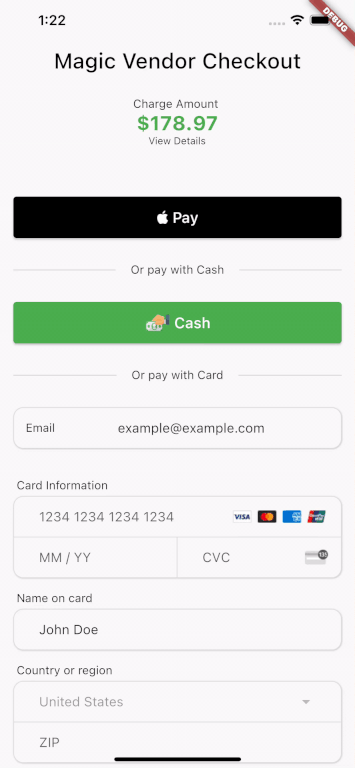

A Widget representing a checkout screen that accepts native and credit card payments along with a button for cash payments if your system has 'in person' payments. This is a UI only widget and is meant to compliment whatever third party transaction api system you are using.

Includes a CreditCardForm widget that allows you to utilize only the credit card form without the rest of the checkout screen if desired.




## Installation

In the `pubspec.yaml` of your flutter project, add the following dependency:
 ``` yaml dependencies:
 checkout_screen_ui: ^1.0.1
```
Import it to each file you use it in:
 ``` dart
 import 'package:checkout_screen_ui/checkout_page.dart';
 ```

## Usage

### Example 1

This example is a very basic checkout page.

```dart
/// Build a list of what the user is buying
final List<PriceItem> _priceItems = [
    PriceItem(name: 'Product A', quantity: 1, totalPriceCents: 5200),
    PriceItem(name: 'Product B', quantity: 2, totalPriceCents: 8599),
    PriceItem(name: 'Product C', quantity: 1, totalPriceCents: 2499),
    PriceItem(name: 'Delivery Charge', quantity: 1, totalPriceCents: 1599, canEditQuantity: false),
];

// build the checkout ui
CheckoutPage(
    priceItems: _priceItems,
    taxRate: 0.07, // 7% tax rate
    payToName: 'Vendor Name Here',
    displayNativePay: true,
    onNativePay: (checkoutResults) => print('Native Pay Clicked'),
    isApple: Platform.isIOS,
    onCardPay: (paymentInfo, checkoutResults){
        // add your own logic to handle the payment

        // paymentInfo: contains information related to the card being used

        // checkoutResults: contains the final list of items and costs the user expects to pay.
        // NOTE: the user has the ability to change the quantity of items in the checkout screen
        // so the final list of items and costs may differ from the original list of items and costs
        // you provided to the checkout screen. MAKE SURE to handle this in your payment logic.
    } ,
    onBack: ()=> Navigator.of(context).pop(),
);
```

## Additional information

- Is there a _bug_ in the code? [File an issue][issue].

If a feature is missing (the Dart language is always evolving) or you'd like an
easier or better way to do something, consider [opening a pull request][pull].
You can always [file an issue][issue], but generally speaking feature requests
will be on a best-effort basis.

[issue]: https://github.com/jonesw5/checkout_screen_ui/issues
[pull]: https://github.com/jonesw5/checkout_screen_ui/pulls
